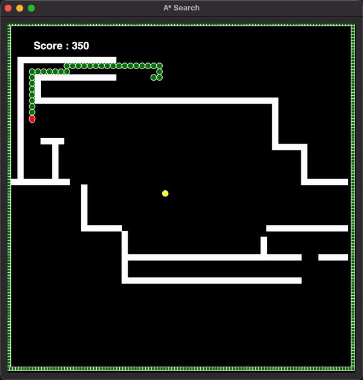

> A Snake Chaser Game with body implementation, built using AI search algorithms.

> [!info]
> You can find the source of this project on [Github](https://github.com/avcton/snake-ai)

<center></center>

# Search Algorithms Implemented

## A* Search

- **Implementation Details:** Uses a priority queue based on the sum of the cost to reach a node and a heuristic estimate to prioritize node expansion. Utilizes the Manhattan distance as the heuristic function to estimate the cost from a node to the goal.
- **Working:** Begins with the source node and explores nodes with the lowest estimated total cost first. Expands nodes by generating possible moves, evaluating their costs, and updating the priority queue accordingly. Continues until the goal node is reached.

## Greedy Best-First Search (GBFS)

- **Implementation Details:** Employs a priority queue but prioritizes nodes solely based on their heuristic values.
- **Working:** Starts from the source node and expands nodes with the lowest heuristic values, aiming to move closer to the goal quickly. Expands nodes by evaluating potential moves, updating the priority queue based on their heuristic values. Stops when the goal node is reached or no more nodes are left to explore.

## Uniform Cost Search (UCS)

- **Implementation Details:** Utilizes a priority queue based solely on the actual path cost from the initial state to prioritize node expansion.
- **Working:** Begins with the source node and expands nodes based on their path costs from the initial state. Considers all possible moves from each node, evaluating their costs and updating the priority queue accordingly. Continues until the goal node is reached or no more nodes are left to explore.

# Additional Integerated Features

- Integrated Multi-processing for parallel processing of 3 different algorithms.
- Handled the body increasing scenario where the snake's body increases after eating food.
- Each algorithm caters the body movement for each step it takes and thus knows where the body will move if it takes a step. This introduces efficiency in the algorithms as they can make moves really close to the body and compute the efficient path even if it's close to the body.

# Test Mazes

We used three different types of mazes for testing the efficiency and effectiveness of our search algorithms and we also ran the snakes for infinitely to see which runs the longest among all.

1. No Hurdles Maze
2. Small Grid 30*30 Hurdle Maze
3. Standard 60*60 Hurdle Maze

# Instructions to Reproduce / Run

Make sure your terminal is open in the project folder.
Run the following command to launch all agents:

```python launch.py```

> [!info]
> Run the following command structure with provided arguments to run specific agent:
>
> => python main.py [A*/GBFS/UCS] [COLOR] [MAZE.TXT] [GAME WINDOW TITLE]

**Example:**
```python main.py A* green Maps/hurdlesMaze.txt "A* Implementation"```

All agents run with the same random seed. Thus the food respawns at the same locations for each agent istance.

# Results/Comparison

Proper documentation and sample trailer videos are available under documentation folder in the provided [source](https://github.com/avcton/snake-ai).

## No Hurdle Maze

Target 500 score

| Algorithm | Time Taken in minutes |
|-----------|-----------------------|
| A*        | 1:33.17               |
| GBFS      | 1:33.79               |
| UCS       | 1:35.73               |

## Small Grid

30*30 Hurdle Maze - Target 300 score

| Algorithm | Time Taken in seconds |
|-----------|-----------------------|
| A*        | 37.41                 |
| GBFS      | 38.61                 |
| UCS       | 38.58                 |

## Standard

60*60 Hurdle Maze - Target 500 score

| Algorithm | Time Taken in minutes |
|-----------|-----------------------|
| A*        | 2:44.53               |
| GBFS      | 3:13.83               |
| UCS       | 2:48:54               |

## Hardcore

60*60 Hurdle Maze - Last to stop wins (infinite)

| Algorithm | Time Taken in minutes | Score | Snake Length | Positions      |
|-----------|-----------------------|-------|--------------|----------------|
| A*        | 8:56.44               | 1110  | 111          | 1st (winner)   |
| GBFS      | 7:34.10               | 910   | 91           | 2nd            |
| UCS       | 3:36.17               | 580   | 58           | 3rd            |

# Conclusion
To sum up all the experiments, we can observe the behavior of each search algorithm by some variables.

## Time

A* Algorithm worked well among other two algorithms in No hurdle maze, in small grid and also in standard maze too. However GBFS also worked fine in no hurdle and in small grid but it took more time in standard grid than other two algorithms. UCS performed better than GBFS in standard grid and took less time to reach the target score.

## Efficient Path Handling

The most efficient and less time-consuming algorithm was A* which was handling all the possible scenarios for finding the shortest path. UCS lacked efficiency in some scenarios because it had no heuristic approach. However, in terms of efficiency, GBFS also performed nearly equal to A*.

## Infinite Run

We ran all three algorithms to check which one can achieve maximum snake length, irrespective of the time taken so as expected A* won(1st position) because it ended up having 111 lengths then GBFS(2nd position) ended up having 91 lengths and the last(3rd position) was UCS which was only 58 in length.
